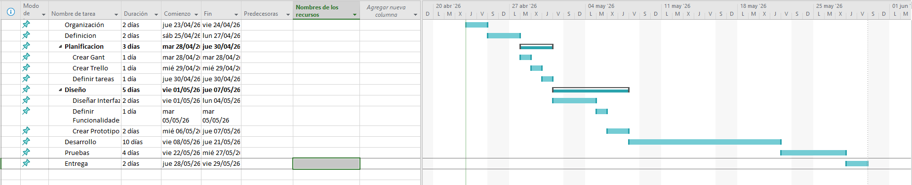
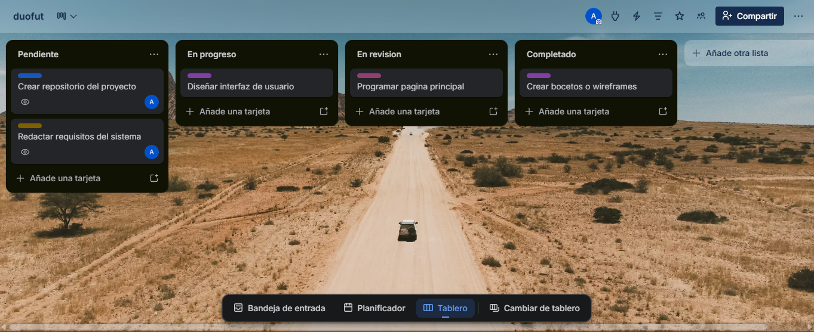

# Diagrama de Gantt

El diagrama de Gantt se ha utilizado para planificar el desarrollo del proyecto, permitiendo organizar las distintas fases, estimar su duración y establecer un orden lógico de trabajo.

## Fases del proyecto

El proyecto se ha dividido en las siguientes fases:

- Organización  
- Definición  
- Planificación  
- Diseño  
- Desarrollo  
- Pruebas  
- Entrega  

Cada una de estas fases tiene una duración estimada en función de la dificultad de las tareas que incluye.

## Duración estimada

Las duraciones de cada tarea son:

- Organización: 2 días  
- Definición: 2 días  
- Planificación: 3 días  
- Diseño: 5 días  
- Desarrollo: 10 días  
- Pruebas: 4 días  
- Entrega: 2 días  

## Organización del trabajo

Las fases se han organizado de forma secuencial, de manera que cada una comienza al finalizar la anterior. Este orden permite seguir una estructura lógica de trabajo, comenzando por la preparación del proyecto y finalizando con la entrega del producto.

## Conclusión

El uso del diagrama de Gantt hace más fácil la visualización del tiempo necesario para completar el proyecto y ayuda a mantener una planificación clara y organizada.

---

# Trello

Para la gestión y organización de las tareas del proyecto se ha utilizado la herramienta Trello.

He creado un tablero donde he distribuido tareas en diferentes listas. Estas listas permiten visualizar el estado de cada tarea en todo momento.

## Estructura del tablero

El tablero se ha organizado en las siguientes columnas:

- Pendiente  
- En progreso  
- En revisión  
- Completado  

Cada tarea se ha representado mediante tarjetas, en las cuales se ha incluido información relevante como los responsables y una etiqueta para diferenciar más fácilmente qué tareas son de cada fase.

## Funcionamiento

Las tareas se van a ir moviendo entre las distintas columnas a medida que avanza el proyecto, permitiendo un seguimiento visual y sencillo del progreso.

Este sistema facilita la organización del trabajo en equipo y ayuda a mantener una planificación clara del proyecto.

